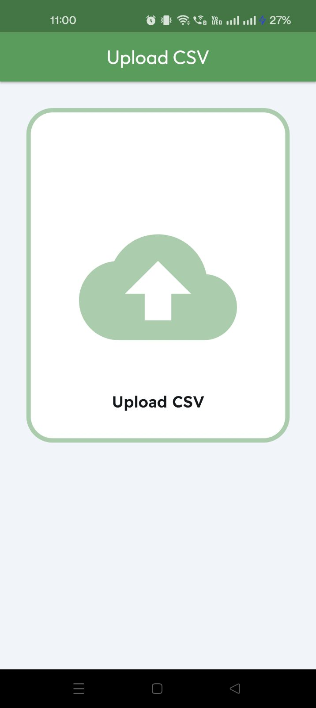
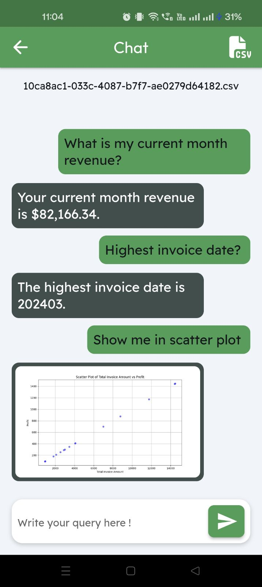
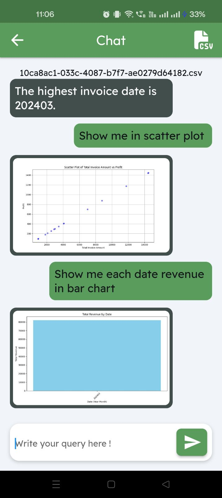

## Financial Data Analysis

### Overview

This project features a robust API designed to streamline the process of analyzing and visualizing financial data from CSV or Excel files. It consists of a FastAPI-based backend that enables users to upload financial data, interact with it through natural language queries, and generate responses based on the uploaded data. Additionally, the backend allows users to retrieve generated images. The Flutter-based frontend provides an intuitive interface for users to access these functionalities, making data analysis accessible and efficient.

### Key Features

- **Natural Language Processing:** Interact with your financial data using simple English queries. Ask questions and receive responses that help you understand and interpret your data effectively.

- **Comprehensive Charting Capabilities:** Generate a wide variety of visualizations to gain insights and present your data:
  - **Line Plot:** Track changes over time or other continuous variables.
  - **Bar Chart:** Compare different categories or groups.
  - **Histogram:** Analyze the distribution of data points.
  - **Pie Chart:** Visualize proportions and percentages.
  - **Scatter Plot:** Identify correlations and relationships between variables.
  - **Box Plot:** Examine data spread and detect outliers.
  - **Heatmap:** Visualize data density and patterns through color-coding.
  - **3D Plot:** Explore complex datasets with three-dimensional visualizations.
  - **Violin Plot:** Understand data distribution and probability density.
  - **Area Plot:** Illustrate cumulative totals or trends over time.
  - **Donut Chart:** Show parts of a whole with a central blank space.
  - **Lollipop Chart:** Highlight individual data points with connecting lines.
  - **Stacked Bar Chart:** Display cumulative totals and compare groups.
  - **Contour Plot:** Analyze and visualize three-dimensional data on a two-dimensional plane.


This API simplifies financial data analysis and visualization, empowering users to make data-driven decisions with ease. Whether you are an analyst, data scientist, or business professional, this tool provides the flexibility and power to meet your data analysis needs.


   
    




## Features

- **Backend (FastAPI):**
  - **File Upload:** Upload CSV or Excel files, with automatic conversion of Excel files to CSV.
  - **Query Generation:** Submit a query to the uploaded file and receive a crafted response.
  - **Image Retrieval:** Retrieve images generated by the AI and stored on the server.
  
- **Frontend (Flutter):**
  - **User Interface:** Provides a user-friendly interface for uploading files, submitting queries, and viewing results.
  - **Cross-Platform:** The Flutter app works on Android, iOS, and web platforms.

## Installation

### Prerequisites

- Python 3.7+
- Flutter SDK (for frontend development)
- An OpenAI API key

### Steps Backend (FastAPI)

1. Clone this repository:

   ```bash
   cd python
   ```

2. Install the required packages:

   ```bash
   pip install -r requirements.txt
   ```

3. Set up environment variables:

   Create a `.env` file in the project root and add your OpenAI API key:

   ```env
   OPENAIKEY=your_openai_api_key
   ```

4. Run the FastAPI server:

   ```bash
   uvicorn main:app --reload --port=3002
   ```

   The server will start at `http://127.0.0.1:3002`.

## API Endpoints

### 1. **Upload File**

   **Endpoint:** `POST /upload-file/`

   **Description:** Upload an Excel or CSV file. If an Excel file is uploaded, it is automatically converted to CSV format.

   **Request:**

   - `file`: The file to upload (CSV or Excel).

   **Response:**

   - `filename`: The name of the saved CSV file.

   **Example:**

   ```bash
   curl -X 'POST' 'http://127.0.0.1:3002/upload-file/' -H 'accept: application/json' -H 'Content-Type: multipart/form-data' -F 'file=@yourfile.csv'
   ```

### 2. **Generate Query**

   **Endpoint:** `POST /query`

   **Description:** Generate a response based on a query and a specific CSV file.

   **Request:**

   - `query_text`: The query string.
   - `filename`: The name of the CSV file to query.

   **Response:**

   - `query`: The original query.
   - `answer`: The generated response.
   - `image_url`: URL of the generated image, if applicable.

   **Example:**

   ```bash
   curl -X 'POST' 'http://127.0.0.1:3002/query' -H 'accept: application/json' -H 'Content-Type: application/json' -d '{
       "query_text": "What is the profit?",
       "filename": "yourfile.csv"
     }'
   ```

### 3. **Get Image**

   **Endpoint:** `GET /get-image/{image_name}`

   **Description:** Retrieve an image generated by the AI and stored on the server.

   **Request:**

   - `image_name`: The name of the image file to retrieve.

   **Response:**

   - Returns the image file.

   **Example:**

   ```bash
   curl -X 'GET' 'http://127.0.0.1:3002/get-image/yourimage.png' -H 'accept: image/png'
   ```

## Logging

- The application uses `loguru` for logging, with logs stored in the `logs` directory.
- Logs are rotated daily at 12:00.

## Directory Structure

- **`uploads/`**: Stores uploaded CSV files.
- **`images/`**: Stores generated image files.
- **`logs/`**: Contains log files.


#### Frontend (Flutter)

1. Navigate to the `frontend` directory:

   ```bash
   cd flutter
   ```

2. Ensure you have the Flutter SDK installed. If not, follow the instructions [here](https://flutter.dev/docs/get-started/install) to install it.

3. Install the required dependencies:

   ```bash
   flutter pub get
   ```

3. Set up environment variables:

   Create a `.env` file in the project root and add your FastAPI backend url:

   ```env
   BACKENDURL=http://127.0.0.1:3002
   ```

5. Run the Flutter app:

   ```bash
   flutter run
   ```

   This command will run the app on your connected device or simulator.


## Contributing

Contributions are welcome! Please submit a pull request or create an issue to discuss changes.

## License

This project is licensed under the MIT License.
